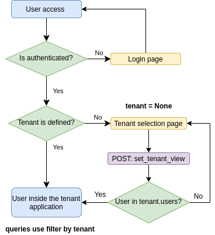

# easy-tenants


[](https://coveralls.io/github/CleitonDeLima/django-easy-tenants?branch=github-ci)
[](https://pypi.org/project/django-easy-tenants/)
[](https://img.shields.io/pypi/dm/django-easy-tenants.svg)


This is a Django app for managing multiple tenants on the same project 
instance using a shared approach.
 
 
## Background

There are typically three solutions for solving the multitenancy problem:

1. Isolated Approach: Separate Databases. Each tenant has it’s own database.
2. Semi Isolated Approach: Shared Database, Separate Schemas. 
One database for all tenants, but one schema per tenant.
3. Shared Approach: Shared Database, Shared Schema. All tenants share 
the same database and schema. There is a main tenant-table, where all 
other tables have a foreign key pointing to.

This application implements the third approach,  which in our opinion, 
is the best solution for a large amount of tenants.

For more information: [Building Multi Tenant Applications with Django
](https://books.agiliq.com/projects/django-multi-tenant/en/latest/)

Below is a demonstration of the features in each approach for an application 
with 5000 tenants.

Approach       | Number of DB | Number of Schemas | Django migration time | Public access
-------------- | ------------ | ----------------- | --------------------- | ---------------
Isolated       | 5000         | 5000              | slow (1/DB)           | No
Semi Isolated  | 1            | 5000              | slow (1/Schema)       | Yes
Shared         | 1            | 1                 | fast (1)              | Yes


## How it works
The following image shows the flow of how this application works.

 


## Instalation
Assuming you have django installed, the first step is to install `django-easy-tenants`.
```bash
pip install django-easy-tenants
```
Now you can import the tenancy module in your Django project.


## Setup
It is recommended to install this app at the beginning of a project. 
In an existing project, depending on the structure of the models, 
the data migration can be hard.

Add `easy_tenants` to your `INSTALLED_APPS` on `settings.py`.

`settings.py`
```python
INSTALLED_APPS = [
    ...,
    'easy_tenants',
]
```
   
Create a model which will be the tenant of the application.

`yourapp/models.py`
```python
from easy_tenants.models import TenantMixin

class Customer(TenantMixin):
    ...
```

Define on your `settings.py` which model is your tenant model. Assuming you created `Customer` 
inside an app named `yourapp`, your EASY_TENANTS_MODEL should look like this:

`settings.py`
```python
EASY_TENANTS_MODEL = 'yourapp.Customer'
```

Your models, that should have data isolated by tenant, need to inherit from `TenantAbstract`
and the objects need to be replaced by `TenantManager()`.


```python
from django.db import models
from easy_tenants.models import TenantAbstract
from easy_tenants.managers import TenantManager

class Product(TenantAbstract):
    name = models.CharField(max_length=10)

    objects = TenantManager()
```

Add the middleware `easy_tenants.middleware.DefaultTenantMiddleware` to your middleware classes.  
_Need to be included after `django.contrib.auth.middleware.AuthenticationMiddleware`._

```python
MIDDLEWARE = [
    'django.middleware.security.SecurityMiddleware',
    'django.contrib.sessions.middleware.SessionMiddleware',
    'django.middleware.common.CommonMiddleware',
    'django.middleware.csrf.CsrfViewMiddleware',
    'django.contrib.auth.middleware.AuthenticationMiddleware',
    'django.contrib.messages.middleware.MessageMiddleware',
    'django.middleware.clickjacking.XFrameOptionsMiddleware',

    'easy_tenants.middleware.DefaultTenantMiddleware',
]
```

Include the `django-easy-tenants` urls.

```python
path('easy-tenants/', include('easy_tenants.urls')),
```

You need to create a view that will list all your tenants and then 
include the name of that view in the settings. This is how the user 
chooses a tenant that will be saved in the user's session.

`views.py`
```python
from django.shortcuts import render

def tenant_list(request):
    user_tenants = request.user.tenants.all()
    return render(request, 'tenant_list.html', {
        'object_list': user_tenants
    })
```

`tenant_list.html`
```html
...
<ul>
  
    <li>
      <form action="" method="post">
        
        <button type="submit">Use {{ object.name }}</button>
      </form>
    </li>
  
</ul>
...
```

`urls.py`
```python
path('tenants/', tenant_list, name='tenant-list'),
```

`settings.py`
```python
EASY_TENANTS_LIST_URL = 'tenant-list'
```

After choosing the tenant, the user is redirected to a URL defined in the 
settings `EASY_TENANTS_REDIRECT_URL`.

`settings.py`
```python
EASY_TENANTS_REDIRECT_URL = 'home'
```  

If a URL is accessed and there is no tenant defined in the session, the user is redirected to 
`EASY_TENANTS_LIST_URL`. If you want to ignore some URLs you can add their name in the 
list `EASY_TENANTS_IGNORE_URLS`, like below.

```python
EASY_TENANTS_IGNORE_URLS = [
    'admin:index',
    'admin:login',
    'namespace:url_name',
]
```

If you want to separate the upload files by tenant, you need to change the `DEFAULT_FILE_STORAGE` 
configuration (only available for local files).

```python
DEFAULT_FILE_STORAGE = 'easy_tenants.storage.TenantFileSystemStorage'
```


## Running the example project
```bash
python manage.py migrate
python manage.py createsuperuser
python manage.py runserver
```
Access the page `/admin/`, create a `Customer` and then add a user on the created `Customer`.

## Motivation
[django-tenant-schemas](https://github.com/bernardopires/django-tenant-schemas)  
[django-tenants](https://github.com/tomturner/django-tenants)  
[django-scopes](https://github.com/raphaelm/django-scopes)  
